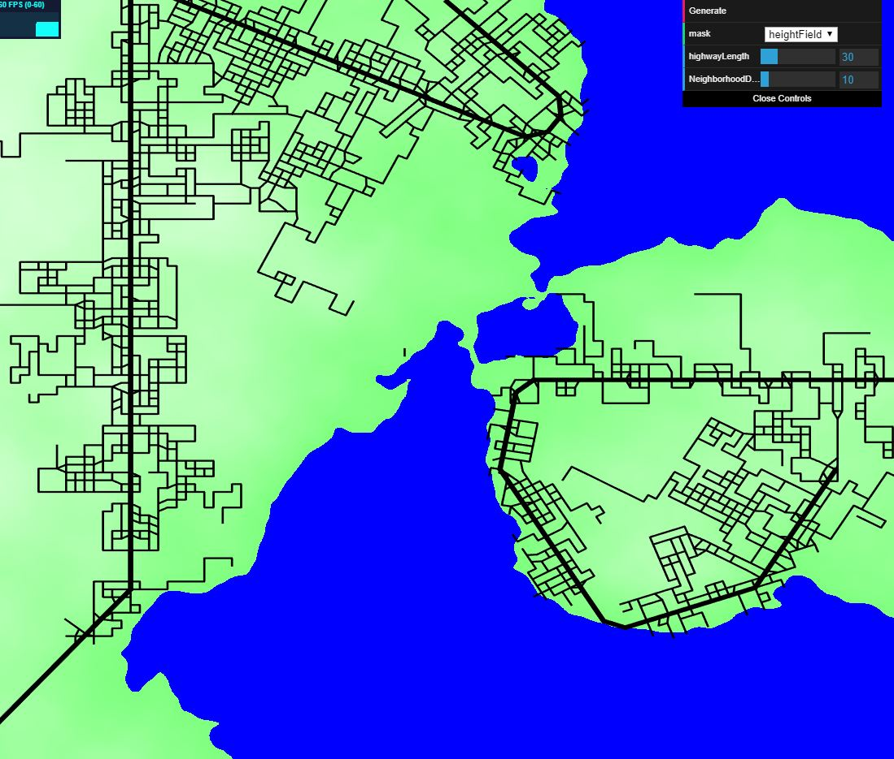
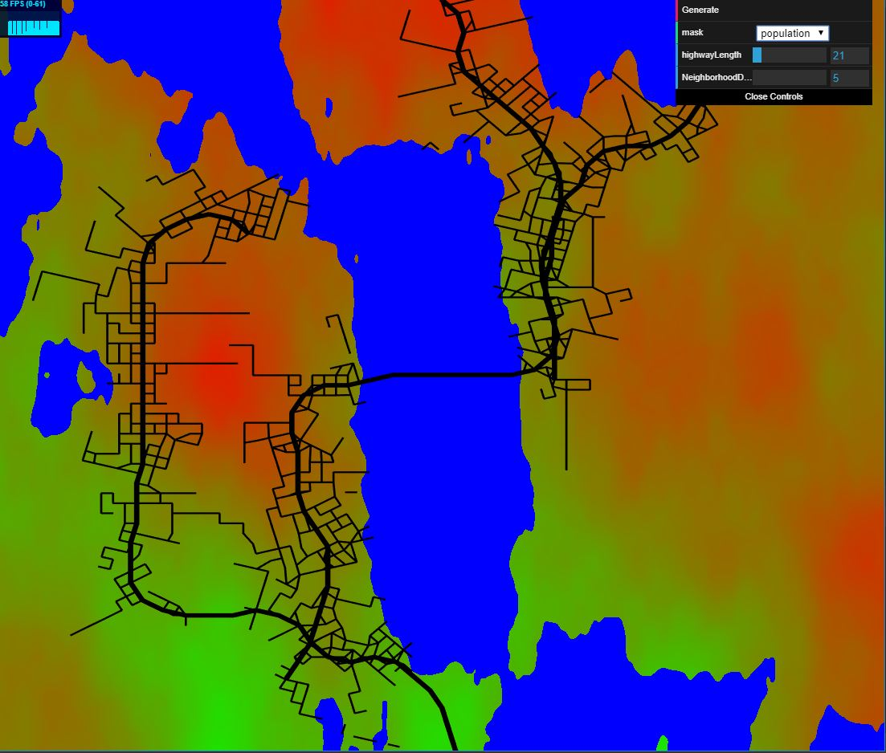
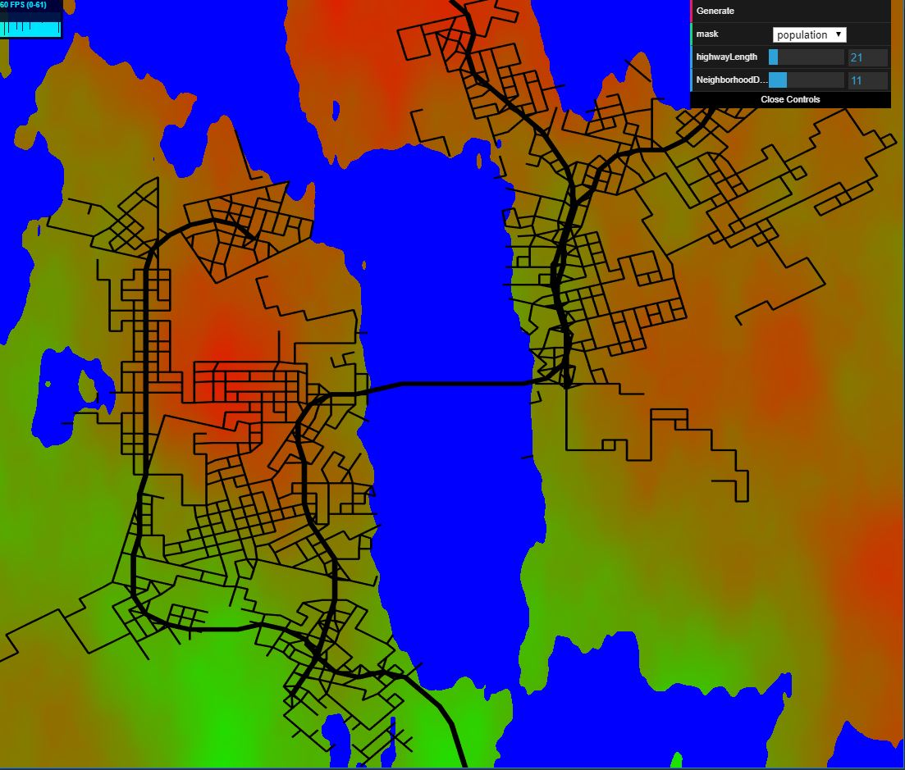
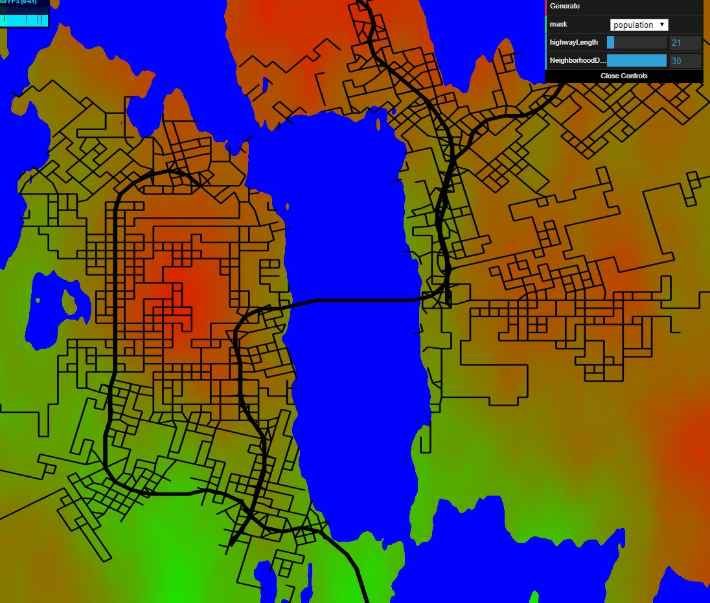

# road-generation

# name and pennkey: lanlou

[DEMO](https://lanlou123.github.io/hw05-road-generation/)

## Features:
- road generation using pseudo L-system
  - the generation of the Highway and neighborhood are seperated, the Highway is generated with an auto direction detection function: which basically
  radiates detection rays into sourrounding for sampling of population density, and then use the highest density direction as target to diverge the forward direction of turtle just a little bit
  (we don't want being too dramatic in highway angles as they generally behave more subtle in real life). The neighbor hood on the other hand , are required to be 
  more compact and denser, thus I simply generate two new turtles at each highway segments' two end points, the newly generated turtles will march
  toward directions that exhibits higher population density as they choose their own direction based on this information just as the highways(there are only three directions: right,left,forward), the newly generated will randomly get
  pushed into a turtle stack which will pop turtle in the future when an intesection appears for newly generated edges with older ones. 
- highway detection for population density area
  - highway will tend to move toward high density population area and in the meantime stay on the same elevation compared to the elevation it was at from the beginning.
- neighborhood detection for population and elevation
  - neighborhood is also sensitive to population and elevation, I used a heuristic and threshold to impose the effects.
- road snapping when colliding
  - all road segments will check sourounding area within certain radius and snap the end points to the conjunction if needed.
- highway able to cross water while neighborhood can't
  - some threshold applied to neighborhood to stop them from swimming.

## Gui options:

- mask: selec which background information we need, population density and elevation are included.
- highwaylength: determines how long highway will travel.
- NeiborhoodDensity: determines the density of Neibourhoods.
  - different neighborhood density:
  - low:
  
  
  - mid:
  
  
  -high
  
  

## Reference:
[Procedural Modeling of Cities](proceduralCityGeneration.pdf)
